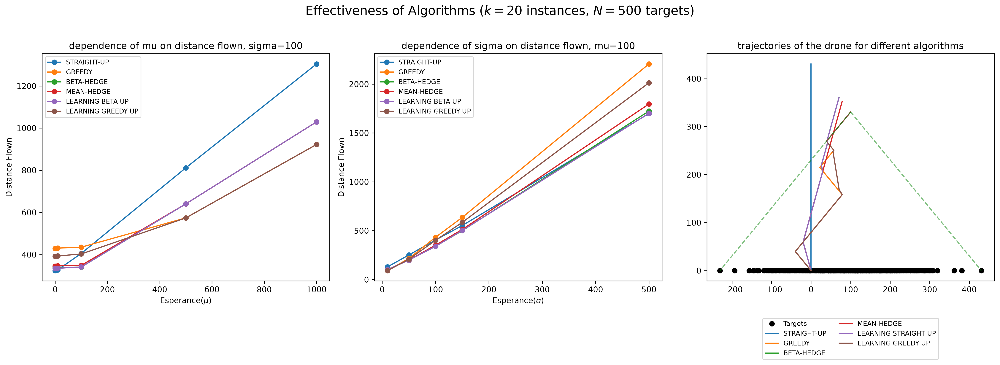

# Learning-Augmented Algorithm for Drone Point Coverage on a Line

This repository contains the source code, simulation environment, and research results conducted during an internship at the **LIP6 laboratory (Sorbonne Université)**. 

The project focuses on the optimization of drone trajectories for the "Point Coverage on a Line" problem. The primary objective is to enhance classical competitive algorithms by integrating Machine Learning predictions (ML Oracle).

## Simulation Results & Report
The comprehensive analysis of the algorithms, trajectory plots, and performance metrics are documented in the PDF report.

  

*(Clicking the link will open the PDF directly inside GitHub's built-in viewer).*

## Implemented Algorithms

The simulation environment implements and benchmarks the following drone movement strategies:
* **Classic $\beta$-HEDGE:** The foundational online competitive algorithm with worst-case performance guarantees.
* **GREEDY:** A baseline greedy strategy for point coverage.
* **STRAIGHT-UP / LEARNING STRAIGHT-UP:** A vertical ascent strategy that adapts based on the incoming request boundaries.
* **MEAN-HEDGE:** An advanced strategy optimizing the trajectory using both the geometric center (apex) and the empirical mean of the request history.

## Evaluation Framework

The evaluation suite automatically generates point requests using normal distributions to test the algorithms under two critical criteria required by learning-augmented frameworks:
1.  **Consistency:** The performance (total distance flown) when the ML predictions are highly accurate (varying the mean $\mu$ with low variance).
2.  **Robustness:** The algorithmic bound and safety when predictions degrade or variance is high (varying the standard deviation $\sigma$).

## Tech Stack
* **Python 3**
* **Pandas** — For data aggregation, simulation logging, and statistical metrics.
* **Matplotlib** — For plotting drone trajectories and generating comparative performance charts.